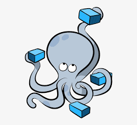

### About me

I am developer and enthusiast in System Verification, Electromechanical Design, Software Development Engineering with a strong interest and expertise in Surgical Robotics🤖 and Visualization Technologies 🧠🏋️.

- 🔭 I'm currently a Software Test Automation Engineer.
- 🌱 At the moment I'm constantly looking for technical challenges.
- ⚡ Fun fact: I like drinking water while working 🏊‍♂️.
- 📚 My Blog: [Stevewiki](https://stevenleon99.github.io/)

#### 🔨 Practical knowledge

  Click👆

<table>
	<tr>
		<th> Property </th>
	 	<th> Data </th>
	<tr>
	<tr>
		<td>Programming languages</td>
		<td>
			

				
				
				
				
					
				
				
			

		</td>
	<tr>
	<tr>
		<td>Web Technologies</td>
		<td>
			

				
				
				
				
			

			

				
				
				
			

			

				
				
				
			

			

				<a href="https://selenium-python.readthedocs.io/" target="_blank">
					
				
			

		</td>
	</tr>
	<tr>
		<td>Databases</td>
		<td>
			

				
				
				
				
				
			

		</td>
	</tr>
	<tr>
		<td>DevOps</td>
		<td>
			

				
				
				
				
			

			

				
				
				
				
			

			

				
				
				
			

			

				 
				
			

			

				 
				
			

			

				
				
			

    	</td>
    </tr>
	<tr>
		<td>Security Tools</td>
		<td>
			

				
				
				
				
				
			

		</td>
	</tr>
	<tr>
		<td>Text Editors</td>
		<td>
				
				
			

		</td>
	</tr>
	<tr> 
		<td>Markup language</td>
		<td>
			

				
				
			

		</td>
	</tr>
</table>

#### 📈 Github statistics

  Click👆

